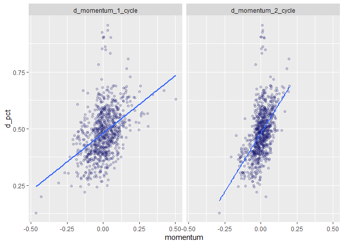
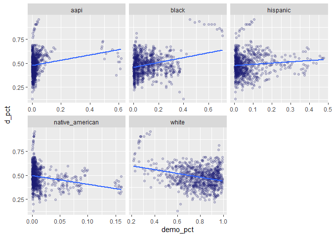
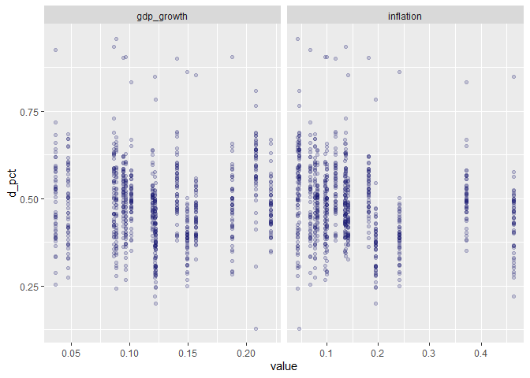
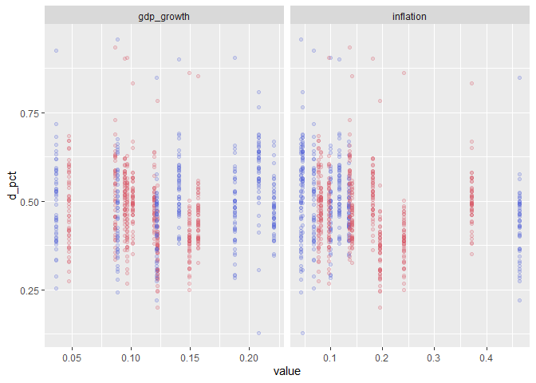

Momentum in Presidential Elections
================
Mark Rieke
9/26/2021

When discussing elections, horserace coverage tends to frame a state’s
expected outcome based on how it’s most recent voting patterns compare
to previous elections. This is, in part, why Florida is framed as
“trending towards Republicans” and Texas is framed as “trending towards
Democrats,” despite the fact that in the 2020 presidential election,
Trump won Texas by a wider margin than Florida!

 That certainly *feels* like a compelling
narrative, but I’m skeptical as to whether these trends can be explained
by momentum My hunch is that other factors, like changing demographics,
national sentiment, & presidential approval, can explain these trends &
that momentum itself offers little explanatory power. To test this
hunch, I’ll build and evaluate a few machine learning models with R’s
suite of machine learning packages,
[`tidymodels`](https://www.tidymodels.org/).

## Exploring the Data

I’ve put together a dataset for examining presidential elections at the
state level since 1960 (for information on the dataset, you can
reference the
[notes](https://github.com/markjrieke/thedatadiary/tree/main/2021.09.26-president_momentum/notes);
to see how it was put together, reference [this
script](https://github.com/markjrieke/thedatadiary/blob/main/2021.09.26-president_momentum/scripts/data_wrangle.R)).
In addition to the usual host of economic & demographic predictor
variables, I’ve added two “momentum” variables - one showing the change
in the democratic voteshare since the previous presidential election and
another showing the change from two elections ago.

``` r
read_csv("data/model_data/model_data.csv") %>%
  filter(state == "Texas") %>%
  knitr::kable(caption = "Model Data (Filtered to Texas")
```

| year | state |    d\_pct | d\_momentum\_1\_cycle | d\_momentum\_2\_cycle |   aapi |  black | hispanic | native\_american |  white | inflation | gdp\_growth | previous\_presidential\_party | democratic\_incumbent\_run | republican\_incumbent\_running | previous\_president\_approval | previous\_president\_disapproval | previous\_president\_net\_approval | d\_pct\_nat |
|-----:|:------|----------:|----------------------:|----------------------:|-------:|-------:|---------:|-----------------:|-------:|----------:|------------:|:------------------------------|:---------------------------|:-------------------------------|------------------------------:|---------------------------------:|-----------------------------------:|------------:|
| 1960 | Texas | 0.5101047 |             0.0669592 |             0.0211773 | 0.0010 | 0.1240 |   0.1480 |           0.0010 | 0.7110 | 0.0814249 |   0.1192671 | Republican                    | No                         | No                             |                          60.1 |                             26.6 |                               33.5 |   0.5008256 |
| 1964 | Texas | 0.6343795 |             0.1242747 |             0.0956170 | 0.0014 | 0.1244 |   0.1596 |           0.0014 | 0.7050 | 0.0460504 |   0.2077217 | Democratic                    | No                         | No                             |                          74.0 |                             15.0 |                               59.0 |   0.6134470 |
| 1968 | Texas | 0.5078087 |            -0.1265707 |            -0.0011480 | 0.0018 | 0.1248 |   0.1712 |           0.0018 | 0.6990 | 0.1343188 |   0.2204475 | Democratic                    | No                         | No                             |                          48.7 |                             38.8 |                               10.5 |   0.4959405 |
| 1972 | Texas | 0.3342683 |            -0.1735404 |            -0.1500556 | 0.0032 | 0.1240 |   0.1836 |           0.0022 | 0.6882 | 0.1954674 |   0.1222417 | Republican                    | No                         | Yes                            |                          51.7 |                             35.9 |                               15.7 |   0.3821389 |
| 1976 | Texas | 0.5159850 |             0.1817167 |             0.0040882 | 0.0056 | 0.1220 |   0.1968 |           0.0026 | 0.6726 | 0.3720379 |   0.1014738 | Republican                    | No                         | No                             |                          51.5 |                             33.6 |                               17.8 |   0.5105229 |
| 1980 | Texas | 0.4283266 |            -0.0876584 |             0.0470291 | 0.0080 | 0.1200 |   0.2100 |           0.0030 | 0.6570 | 0.4628670 |   0.1212904 | Democratic                    | Yes                        | No                             |                          33.7 |                             55.0 |                              -21.3 |   0.4469466 |
| 1984 | Texas | 0.3621369 |            -0.0661896 |            -0.0769240 | 0.0124 | 0.1196 |   0.2280 |           0.0034 | 0.6366 | 0.2408501 |   0.1490947 | Republican                    | No                         | Yes                            |                          62.0 |                             29.0 |                               32.9 |   0.4083038 |
| 1988 | Texas | 0.4365367 |             0.0743997 |             0.0041050 | 0.0168 | 0.1192 |   0.2460 |           0.0038 | 0.6162 | 0.1408183 |   0.1568228 | Republican                    | No                         | No                             |                          63.1 |                             29.0 |                               34.1 |   0.4609820 |
| 1992 | Texas | 0.4775784 |             0.0410417 |             0.0577207 | 0.0208 | 0.1182 |   0.2680 |           0.0044 | 0.5896 | 0.1818182 |   0.0946463 | Republican                    | No                         | Yes                            |                          54.7 |                             36.7 |                               17.9 |   0.5345497 |
| 1996 | Texas | 0.4733938 |            -0.0041846 |             0.0184285 | 0.0244 | 0.1166 |   0.2940 |           0.0052 | 0.5568 | 0.1164432 |   0.1401298 | Democratic                    | Yes                        | No                             |                          58.8 |                             33.6 |                               25.2 |   0.5474133 |
| 2000 | Texas | 0.3904373 |            -0.0829565 |            -0.0435705 | 0.0280 | 0.1150 |   0.3200 |           0.0060 | 0.5240 | 0.0992415 |   0.1873169 | Democratic                    | No                         | No                             |                          67.0 |                             30.8 |                               36.2 |   0.5026805 |
| 2004 | Texas | 0.3848981 |            -0.0055392 |            -0.0442478 | 0.0320 | 0.1162 |   0.3424 |           0.0064 | 0.4956 | 0.0971823 |   0.0966287 | Republican                    | No                         | Yes                            |                          50.1 |                             45.1 |                                5.0 |   0.4875601 |
| 2008 | Texas | 0.4406406 |             0.0557426 |             0.0251017 | 0.0360 | 0.1174 |   0.3648 |           0.0068 | 0.4672 | 0.1372904 |   0.0865780 | Republican                    | No                         | No                             |                          27.8 |                             66.5 |                              -34.5 |   0.5368885 |
| 2012 | Texas | 0.4199210 |            -0.0207196 |             0.0175115 | 0.0414 | 0.1188 |   0.3794 |           0.0076 | 0.4440 | 0.0674808 |   0.0364484 | Democratic                    | Yes                        | No                             |                          51.4 |                             43.5 |                                8.2 |   0.5196386 |
| 2016 | Texas | 0.4528677 |             0.0329467 |             0.0061136 | 0.0482 | 0.1204 |   0.3862 |           0.0088 | 0.4260 | 0.0436155 |   0.0885840 | Democratic                    | No                         | No                             |                          57.9 |                             38.3 |                               13.2 |   0.5111329 |
| 2020 | Texas | 0.4716928 |             0.0188250 |             0.0258859 | 0.0550 | 0.1220 |   0.3930 |           0.0100 | 0.3970 | 0.0774424 |   0.0471825 | Republican                    | No                         | Yes                            |                          38.7 |                             57.9 |                              -12.1 |   0.5226799 |

Model Data (Filtered to Texas

Let’s look into how some of these variables relate to each other!

``` r
elections <- read_csv("data/model_data/model_data.csv")

elections %>%
  select(d_pct, ends_with("cycle")) %>%
  pivot_longer(cols = ends_with("cycle"),
               names_to = "cycle",
               values_to = "momentum") %>%
  ggplot(aes(x = momentum,
             y = d_pct)) +
  geom_point(alpha = 0.2,
             color = "midnightblue") +
  geom_smooth(method = "lm", se = FALSE) +
  facet_wrap(~cycle) +
  theme(legend.position = "none")
```

<!-- -->

Right off the bat, it looks like there *is* a relationship between the
newly created momentum variables and the democratic voteshare, though
*how* important each variable is to the overall model remains to be
determined. As it stands now, however, we can’t simply rule out momentum
as a factor prior to analysis, since there clearly is some correlation
with vote outcome.

``` r
elections %>%
  select(d_pct, aapi, black, hispanic, white, native_american) %>%
  pivot_longer(cols = -d_pct,
               names_to = "demo",
               values_to = "demo_pct") %>%
  ggplot(aes(x = demo_pct,
             y = d_pct)) +
  geom_point(alpha = 0.2,
             color = "midnightblue") +
  facet_wrap(~demo, scales = "free_x") +
  geom_smooth(method = "lm", se = FALSE) +
  theme(legend.position = "none")
```

    ## `geom_smooth()` using formula 'y ~ x'

<!-- -->

Looking at the how demographics influence outcomes, there may be an
opportunity for some interesting [feature
engineering](https://en.wikipedia.org/wiki/Feature_engineering) later
down the line. That being said, there is likely a good amount of
redundant information in these charts, since the total percentage always
has to add up to 100%.

``` r
elections %>%
  select(d_pct, inflation, gdp_growth) %>%
  pivot_longer(cols = -d_pct,
               names_to = "metric",
               values_to = "value") %>%
  ggplot(aes(x = value,
             y = d_pct)) +
  geom_point(alpha = 0.2,
             color = "midnightblue") +
  facet_wrap(~metric, scales = "free_x") +
  theme(legend.position = "none")
```

<!-- -->

It looks like there’s a bit of non-linearity between the economic
factors & the democratic voteshare. Since these two measurements are
showing the change in GDP & inflation over the previous 4 years, it may
make sense to check for an
[interaction](https://en.wikipedia.org/wiki/Interaction_(statistics))
with the variable `previous_president_party`.

``` r
elections %>%
  select(d_pct, inflation, gdp_growth, previous_presidential_party) %>%
  pivot_longer(cols = c(inflation, gdp_growth),
               names_to = "metric",
               values_to = "value") %>%
  ggplot(aes(x = value,
             y = d_pct,
             color = previous_presidential_party)) +
  geom_point(alpha = 0.2) +
  facet_wrap(~metric, scales = "free_x") +
  scale_color_manual(values = c(dd_blue, dd_red)) +
  theme(legend.position = "none")
```

<!-- -->

Using all the variables listed above, I’ll train the following models to
predict the Democratic voteshare (`d_pct`) in each state and check the
importance of each variable along the way:

-   Basic Logistic Regression
-   Regularized Logistic Regression
-   Tuned Logistic Regression
