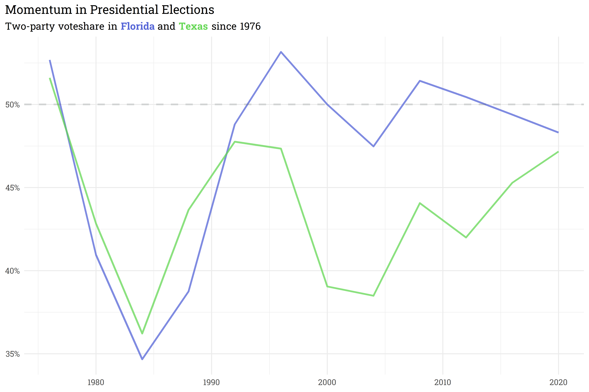

Momentum in Presidential Elections
================
Mark Rieke
9/26/2021

When discussing elections, horserace coverage tends to frame a state’s
expected outcome based on how it’s most recent voting patterns compare
to previous elections. This is, in part, why Florida is framed as
“trending towards Republicans” and Texas is framed as “trending towards
Democrats,” despite the fact that in the 2020 presidential election,
Trump won Texas by a wider margin than Florida!

 That certainly *feels* like a compelling
narrative, but I’m skeptical as to whether these trends can be explained
by momentum My hunch is that other factors, like changing demographics,
national sentiment, & presidential approval, can explain these trends &
that momentum itself offers little explanatory power. To test this
hunch, I’ll build and evaluate a few machine learning models with R’s
suite of machine learning packages,
[`tidymodels`](https://www.tidymodels.org/).
