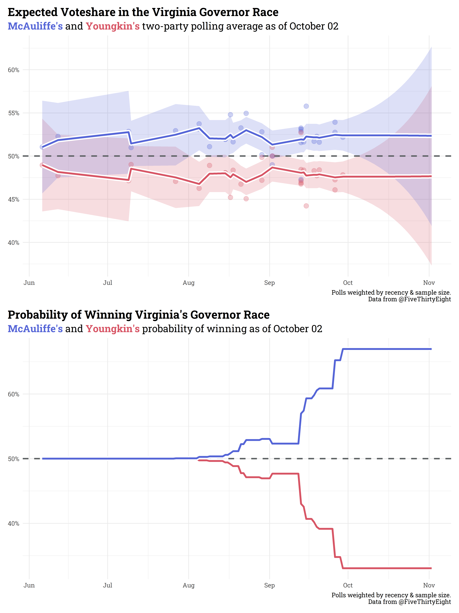

```{r setup, include=FALSE}
knitr::opts_chunk$set(echo = TRUE)
```

### The problem with simple averages

Rolling poll averages can be misleading in the absence of errorbars or an expected distribution of outcomes. FiveThirtyEight is currently [tracking polls of Virginia's Governor race](https://projects.fivethirtyeight.com/polls/governor/virginia/) slated for early November, and has kindly made their polls [available to the public](https://projects.fivethirtyeight.com/polls-page/data/governor_polls.csv). Their current polling average, however, looks to be a simple rolling average and doesn't include a confidence interval. I've attempted to improve upon their tracker here by providing a weighted polling average and 95% confidence interval.



### How this works

Using a weak uniform prior, the two-party polling average (aka, the polling average if including only Democrats & Republicans) is updated daily via [Bayes' theorem](https://en.wikipedia.org/wiki/Bayes%27_theorem). Each poll is weighted by sample size and recency. As time passes, the effect a poll has on the weighted average shrinks (this is why the confidence interval "fans out" beyond the present day; as time passes, we gradually lose confidence in the polling average). Each candidate's probability of winning on any given day is the portion of the projected election-day polling distribution in their favor, based on that day's polling average. 

### A few caveats/some closing thoughts

This is an inherently flawed method. The sample size & recency weighting methods are somewhat arbitrary, and this ignores other weighting factors, like pollster and survey methodology, that [should be included](https://gelliottmorris.substack.com/p/what-people-are-missing-about-the?justPublished=true). It is, however, transparent - you can view the code [here](https://gelliottmorris.substack.com/p/what-people-are-missing-about-the?justPublished=true). I'd happily welcome any comments/criticism!

This will be updated daily (I'll manually rerun/recommit until I can figure out GitHub Actions). This page will always show the current day's average & projection, but historical runs can be found in the [plots folder](https://github.com/markjrieke/thedatadiary/tree/main/2021.10.01-virginia_governors_race/plots).

#### UPDATE 10.15.21

I've added a filter to remove polls conducted by [Rasmussen](https://www.rasmussenreports.com/) and [Trafalgar](https://www.thetrafalgargroup.org/). Trafalgar is [banned by the Economist](https://docs.google.com/spreadsheets/d/e/2PACX-1vQ56fySJKLL18Lipu1_i3ID9JE06voJEz2EXm6JW4Vh11zmndyTwejMavuNntzIWLY0RyhA1UsVEen0/pub?gid=0&single=true&output=csv) & Rasmussen is clearly partisan [here's just one example](https://twitter.com/Rasmussen_Poll/status/1448819612242616324?ref_src=twsrc%5Etfw%7Ctwcamp%5Eembeddedtimeline%7Ctwterm%5Eprofile%3ARasmussen_Poll%7Ctwgr%5EeyJ0ZndfZXhwZXJpbWVudHNfY29va2llX2V4cGlyYXRpb24iOnsiYnVja2V0IjoxMjA5NjAwLCJ2ZXJzaW9uIjpudWxsfSwidGZ3X2hvcml6b25fdHdlZXRfZW1iZWRfOTU1NSI6eyJidWNrZXQiOiJodGUiLCJ2ZXJzaW9uIjpudWxsfSwidGZ3X3NwYWNlX2NhcmQiOnsiYnVja2V0Ijoib2ZmIiwidmVyc2lvbiI6bnVsbH19%7Ctwcon%5Etimelinechrome&ref_url=https%3A%2F%2Fwww.rasmussenreports.com%2F). Removing from this average follows the general consensus on ET (though, to be transparent, ET does slant far to the left). In future polling projects, I'd hope to develop some more robust methodology to programatically downweight problematic pollsters (how's *that* for a tongue twister?), but for now I'm just going to outright exclude.

